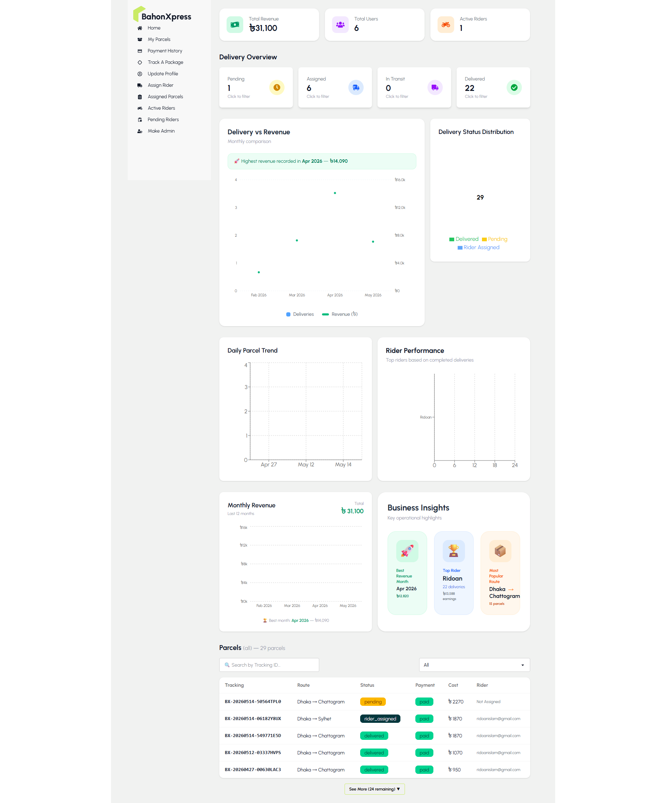
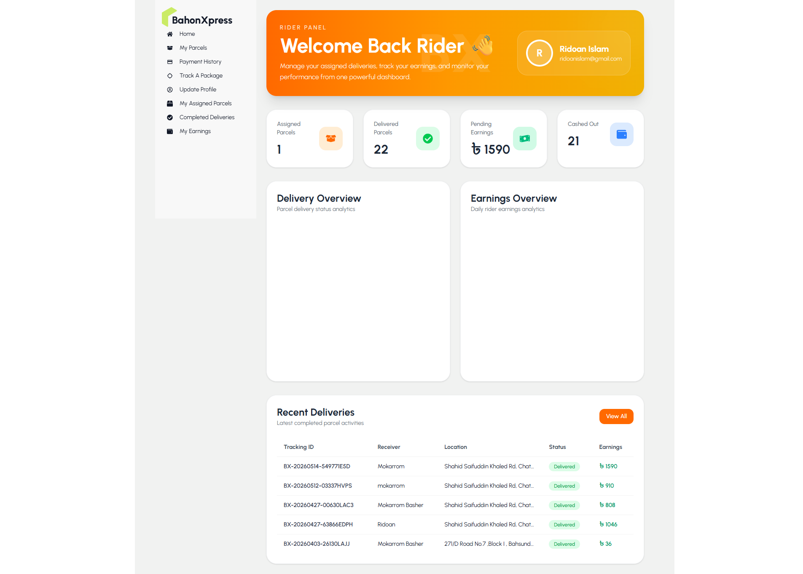
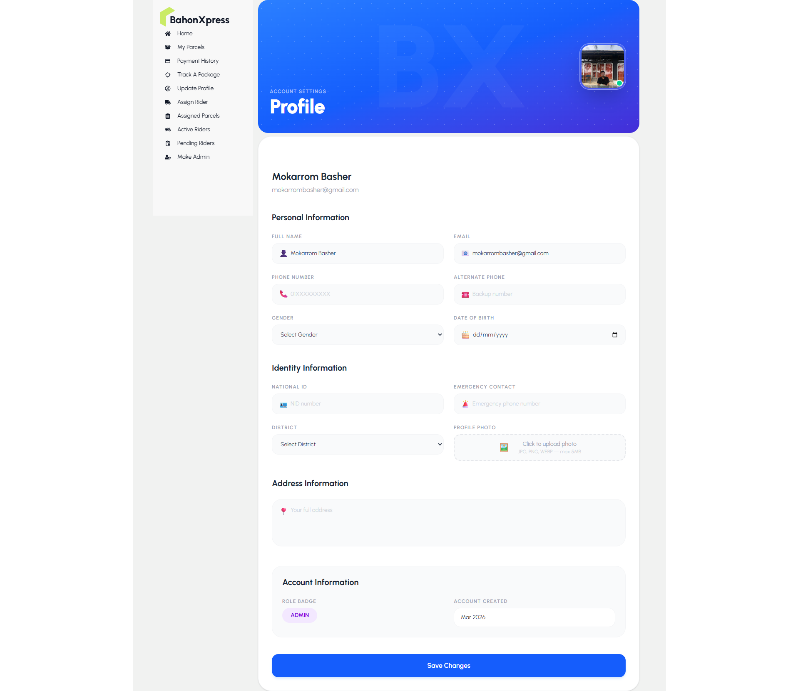

# 🚚 BahonXpress

## Overview

BahonXpress is a full-stack logistics SaaS platform for parcel delivery management.

## Features

### User
- Create parcel
- Online payment
- Track delivery
- Manage profile

### Rider
- View assigned parcels
- Update delivery status
- Earnings dashboard
- Cash out system

### Admin
- Manage users
- Manage riders
- Assign deliveries
- Revenue analytics
- Business insights dashboard

## Technologies

Frontend:
React.js
Tailwind CSS
TanStack Query
Firebase Auth
Axios

Backend:
Node.js
Express.js
MongoDB
Stripe
Firebase Admin SDK

Security:
Helmet
CORS
Rate Limit
JWT verification

## Live Links
https://bahonxpress.web.app/

## 🔐 Demo Credentials

### Admin

Email:
mokarrombasher@gmail.com

Password:
01609528183

### Rider

Email:
ridoanislam@gmail.com

Password:
1234567890

### User

Email:
jannatul@gmail.com

Password:
0987654321

## 📸 Screenshots

### Home Page

### Admin Dashboard

### Rider Dashboard

### Profile Management

## 🔗 Repository Links

Frontend:
https://github.com/mokarrom17/bahonxpress-client

Backend:
https://github.com/mokarrom17/bahonxpress-server
